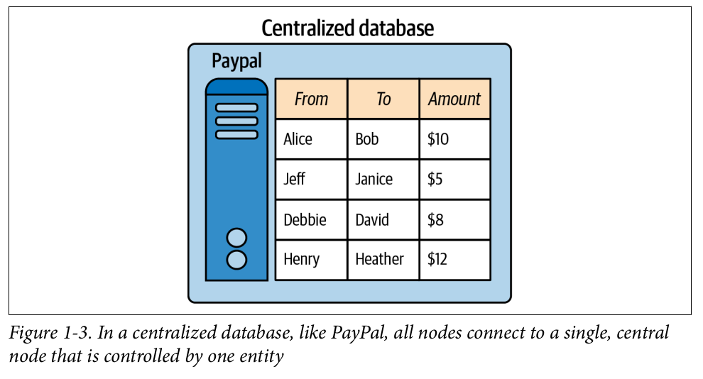
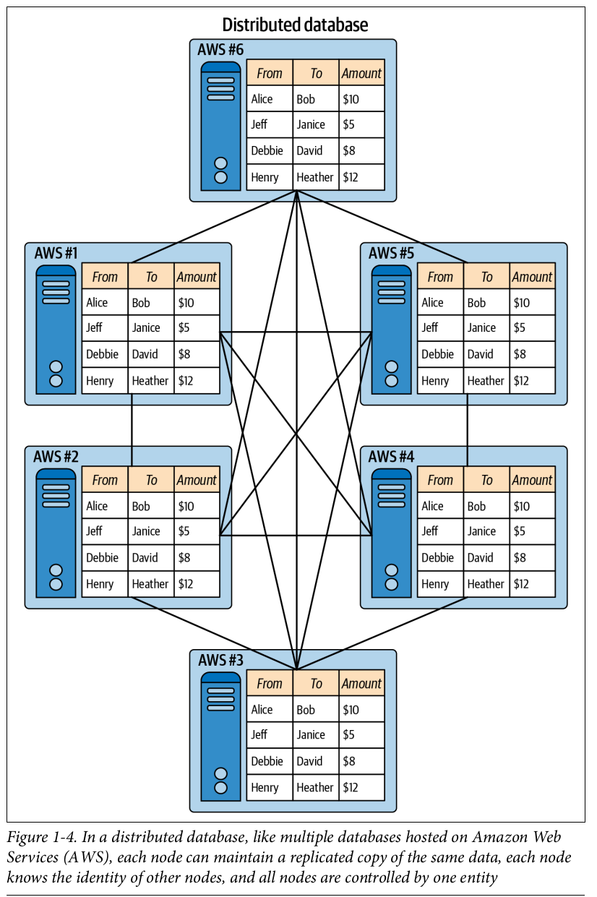
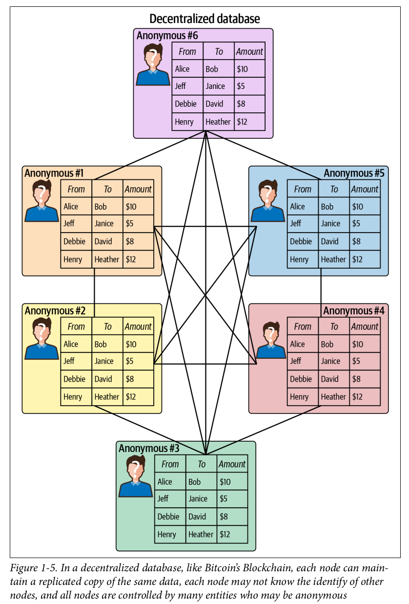

Using online services requires a third party entity to act as a trusted gatekeeper.  
There are two types of trust in the context of these systems:  

    1- Intermediary trust: A third party is relied on to make
    rational and fair decisions.

    2- Issuance trust: A third party is relied on to ensure the 
    safety and security of any value.

Using physical money is on decline. Instead people are increasingly using  
electronical financial tools. Shifting payment interfaces from physical to  
digital requires mechanisms to ensure trust especially to third parties.  
Blockchain is another technology to establish trust. 

Bitcoin was the first working system that utilizes blockchain, but it has  
predecessors that failed. One of the main reason of this failures was inability  
to put a distributed system together on the internet.  

Distributed systems aim to create systems that has no single point of failure.  
It means even a part of the system is broken, system still can continue to work.  
Internet is also working in distributed way, but today a few companies dominated  
internet. Blockchain and its distributed technology is also hope of some people   
that wishes to mitigate this dominance by giving individual users more control.  
(But it must be implemented in the way to prevent new dominants. Otherwise it   
faces same situation as internet which is a distributed technology by itself,  
but still gave birth to a few centralized, dominant companies. By the way   
internet is just the network, if content is referenced it must be web.)  

In distributed systems, processing is not done solely on one computers. Instead  
it is distributed across nodes. The common goal is to use processing power to  
collectively accomplish a task by distributing responsibility across many  
computers, and to prevent single point of failure. Hence, a distributed system  
has characteristics of decentralization. In a fully decentralized system, a node  
doesn't necessarily collaborate with every other node to achive its objective, and  
decision making is done through concensus instead of relying on a single entity  
to make decisions and determine objectives.

